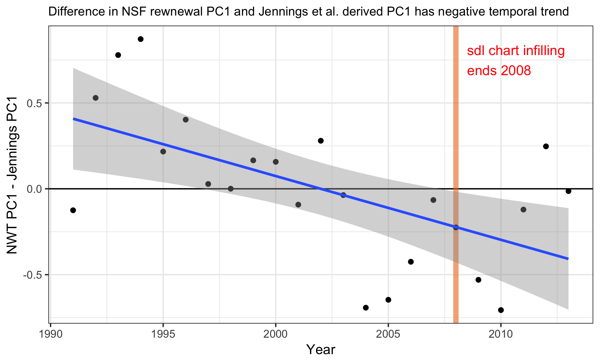
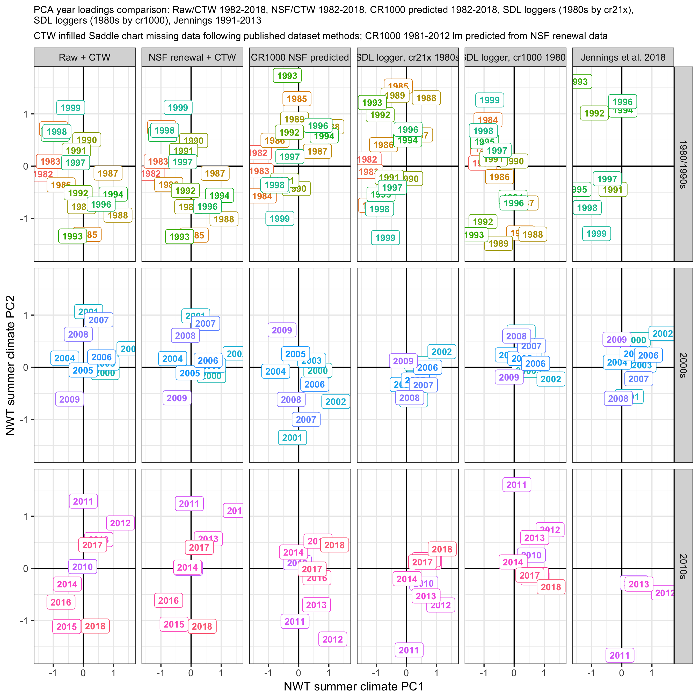

Extended summer PCA sensitivity analysis (preliminary)
================
CTW
2019-04-11

### Sensitivity of extended summer scores and input metrics to source precip/temp dataset

 Fig 1.  Fig 2.

 Fig 3.  Fig 4.

 Fig 5.  Fig 6.

### Compare raw source data

Some visuals of the raw data to highlight the origin of the any differences above..

Looking at the raw data, precipitation in the two source datasets overlaps well except for a handful of differences in later years. The extended summer analysis strongly considers just summer months' (JJA) precipitation, which overlaps well in all years (not shown). TMIN and TMAX tend to have warmer values in the Jennings infilled dataset. The NWT NSF data have a single max temp and min temp value per day, whereas the Jennings dataset provides hourly average air temperature. I took the max and min of those hourly values, per day, which gives the Jennings TMIN and TMAX values shown here. Daily TMEAN used in the extended summer analysis is the average of daily TMIN and TMAX.

Looking at temperature by season, the biggest differences are in the summer months (JJA):

Spring and fall temperatures in both datasets overlap better compared to the summer months. For metrics used in the extended summer PCA, spring temperature values are used to calculate warming temperature thresholds ("fivedayrunning5C" and "fivedayrunnings12C"). Fall temperature values are used to calculate 3-day running minimum temperature thresholds ("GSLthreedayneg3C").

